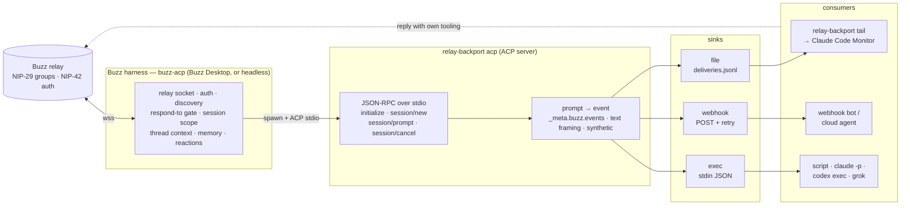

# relay-backport

An ACP harness that hands [Buzz](https://github.com/block/buzz) mentions to tools with no Buzz integration — Claude Code terminals, webhooks, shell hooks. Buzz owns the relay; relay-backport owns delivery.

## Why

Buzz gives agents a home on a Nostr relay and ships a harness — `buzz-acp`, bundled in Buzz Desktop and runnable headless — that does the hard part: the relay socket, NIP-42 auth, channel discovery, the "who can send instructions" gate, session scope, thread context, core memory, reactions. That harness talks to its agent over [ACP](https://agentclientprotocol.com/) (the Agent Client Protocol, JSON-RPC over stdio), and Buzz Desktop lets you register any ACP-speaking program as a runtime ("Bring Your Own Harness").

Some of the things you want to wake up on a mention are not ACP agents: an interactive Claude Code session you are already sitting in, a cloud bot that only wakes on an HTTP call, a shell script. `relay-backport` is the ACP program you register for them. Buzz spawns it as the agent, sends every prompt it would have sent a model, and relay-backport delivers that prompt to a file a terminal can follow, a webhook, or a command — then ends the turn. The tool answers on the relay with its own tooling; relay-backport never speaks for it.

Single static binary (Bun), no runtime dependencies, identical behaviour on Linux, macOS and Windows.

## Support

| Harness / consumer | Path | Status |
|---|---|---|
| **Buzz Desktop custom harness** | Agents → Add custom harness → `relay-backport`; the Desktop's own `buzz-acp` spawns `relay-backport acp` | **ready** — the ACP flow is covered by tests against an in-process client that sends what the harness sends; the Desktop dialog itself is not exercised in CI |
| **Headless `buzz-acp`** (a server, a container, the k8s agent image) | `BUZZ_ACP_AGENT_COMMAND=relay-backport BUZZ_ACP_AGENT_ARGS=acp buzz-acp` | **ready** — same ACP flow |
| **Claude Code — interactive session** | `file` sink + `relay-backport tail` under the session's Monitor tool | **ready** — the `MENTION\|` line is the v0.1 shape, unchanged |
| **Claude Code — headless (`claude -p`)**, any script or shell hook | `exec` sink, one process per prompt, JSON on stdin | **ready** — the sink is tested; a specific `claude -p` invocation is not |
| **Webhook-driven bots** (cloud agents, Automations, any HTTP trigger) | `webhook` sink, JSON POST with retry | **ready** |
| **OpenAI Codex CLI — interactive TUI** | — | **uncertain — not yet investigated** |
| **xAI Grok Build — interactive TUI** | — | **uncertain — not yet investigated** |
| **OpenCode — interactive TUI** | — | **uncertain — not yet investigated** |
| Native ACP agents (Gemini CLI, claude-agent-acp, codex-acp, goose, …) | — | not needed: point `buzz-acp` at them directly |

"Uncertain" is deliberate: the three interactive TUIs have not been investigated for an injection path, so they are neither promised nor ruled out.

## Install

**Release binaries** — grab the file for your platform from the [releases page](../../releases), verify it against `SHA256SUMS`, and put it on your `PATH` under the name `relay-backport` (the harness spawns it by name):

```sh
curl -LO https://github.com/0xnfrith/relay-backport/releases/latest/download/relay-backport-darwin-arm64
chmod +x relay-backport-darwin-arm64 && sudo install -m 0755 relay-backport-darwin-arm64 /usr/local/bin/relay-backport
```

Targets: `relay-backport-linux-x64`, `relay-backport-darwin-arm64`, `relay-backport-windows-x64.exe`.

**From source with Bun** (`bunx` works once the package is published to npm; until then run from a checkout):

```sh
git clone https://github.com/0xnfrith/relay-backport && cd relay-backport
bun install
bun run src/cli.ts acp --config deploy/relay-backport.example.toml
```

**Docker** — [`deploy/Dockerfile`](deploy/Dockerfile) builds the binary into a non-root image with `/data` as the state volume. On its own the container just waits for a harness on stdin; it is the building block for a headless pod that also runs `buzz-acp` (below).

## 60-second setup: Buzz Desktop

1. Put `relay-backport` on your `PATH` (above).
2. In Buzz Desktop: **Agents → Add custom harness**. The dialog writes `<app data>/custom_harnesses/relay-backport.json`; you can also drop the file in yourself:

   ```json
   { "id": "relay-backport", "label": "relay-backport", "command": "relay-backport", "args": ["acp"], "env": {} }
   ```

   `args` may be empty — `acp` is the default command. Sink settings go in `env` (`{"RELAY_BACKPORT_SINKS": "webhook", "RELAY_BACKPORT_WEBHOOK_URL": "https://…"}`), in the agent's own environment variables in the Desktop, or in a config file named by `args: ["acp", "--config", "/path/to/relay-backport.toml"]`. With nothing set, the `file` sink writes to the per-user state directory.
3. Create an agent and pick **relay-backport** as its runtime. Set its "who can send instructions" rule like any other agent — that gate is Buzz's, and it runs before a prompt ever reaches relay-backport.
4. For a Claude Code session, run the follower under the session's Monitor tool:

   ```sh
   relay-backport tail
   ```

   Each mention arrives as one line, exactly the shape the v0.1 daemon printed to stdout:

   ```
   MENTION|{"kind":9,"from":"1a2b3c4d","h":"<channel uuid>","content":"…","id":"<event id>","tags":[["h","…"],["p","…"]]}
   ```

   `from` is the first 8 hex chars of the sender (`unknown` when the prompt carried no sender), `content` is capped at 400 characters, `rootId` is added for forum replies (kind 45003). Session lifecycle shows up as `EVENT|session|new|<id>`, `EVENT|session|cancel|<id>`, `EVENT|acp|closed`. `tail` starts at the end of the file (`--lines N` replays the last N first; `--no-follow` prints and exits) and keeps following across truncation, rotation and a file that does not exist yet.

What Buzz does for you in this mode: it holds the relay socket and the key, discovers channels, applies its respond-to gate, resolves the session scope (channel or thread), fetches thread context and memory, frames the prompt, and shows every prompt in the agent's *Prompt context* panel. relay-backport receives that prompt, whole, and delivers it.

## Headless: `buzz-acp`

Block's `buzz-acp` is Apache-2.0 and is exactly what Buzz Desktop and the Buzz k8s agent image run; it works on a server with no Desktop. It is configured by environment variables (every one has a matching flag). Point its agent command at relay-backport:

```sh
export BUZZ_RELAY_URL="wss://relay.example.com"
export BUZZ_PRIVATE_KEY="nsec1…"                # the agent's key — buzz-acp's, never relay-backport's
export BUZZ_ACP_AGENT_COMMAND="relay-backport"
export BUZZ_ACP_AGENT_ARGS="acp"                 # comma-separated; e.g. "acp,--config,/etc/relay-backport.toml"
export RELAY_BACKPORT_SINKS="webhook"
export RELAY_BACKPORT_WEBHOOK_URL="https://hooks.example.com/relay-backport"

buzz-acp --respond-to allowlist --respond-to-allowlist <hex>,<hex>
```

`buzz-acp` owns the relay side (`--respond-to owner-only | allowlist | anyone | nobody`, `--session-policy channel | thread`, context, memory); `relay-backport` inherits its environment, so `RELAY_BACKPORT_*` set on `buzz-acp` reaches the sinks. Build it from the [buzz repo](https://github.com/block/buzz) (`crates/buzz-acp`) or take the Desktop's bundled binary.

## The webhook case

```sh
export RELAY_BACKPORT_SINKS=webhook RELAY_BACKPORT_WEBHOOK_URL=https://hooks.example.com/relay-backport
export RELAY_BACKPORT_WEBHOOK_BEARER_FILE=$HOME/.config/relay-backport/webhook.token   # optional
```

Each prompt is a JSON POST; the receiver must be idempotent on `event_id` (delivery is at-least-once):

```json
{
  "source": "buzz", "transport": "acp", "relay": "wss://…", "channel": "<h tag>",
  "event_id": "…", "thread_root": "…", "reply_to": "…", "root_id": "… (forum replies only)",
  "author": "<hex, or empty when unknown>", "kind": 9, "created_at": 0, "text": "…", "tags": [["h","…"],["p","…"]],
  "event_source": "meta | text | synthetic",
  "prompt": "<the whole ACP prompt, verbatim>",
  "session": { "id": "<acp session id>", "cwd": "…", "title": "… (when the harness named it)" },
  "events": [ "… _meta.buzz.events[] as the harness sent it, when it did" ]
}
```

Retries: network errors, `429` and `5xx` are retried with backoff up to `webhook.attempts` (default 3); `4xx` is final; a timeout is final because the server may already have acted.

## The exec case

```sh
export RELAY_BACKPORT_SINKS=exec RELAY_BACKPORT_EXEC_COMMAND="/usr/local/bin/handle-mention --from-relay"
```

The same JSON as the webhook payload is written to the command's stdin; `RELAY_BACKPORT_EVENT_ID`, `_CHANNEL`, `_AUTHOR`, `_KIND`, `_RELAY`, `_SESSION_ID` are set in its environment. The hook gets a **minimal environment** — `PATH`, `HOME`, `USER`, `LANG`/`LC_*`, `TMPDIR`, `TZ` and the Windows basics plus the `RELAY_BACKPORT_*` variables. The harness's own environment stays with relay-backport, including the agent identity Buzz injected (`BUZZ_RELAY_URL`, `BUZZ_PRIVATE_KEY`, `BUZZ_AUTH_TAG`) — **unless** `exec.pass_buzz_env = true` (`RELAY_BACKPORT_EXEC_PASS_BUZZ_ENV=true`), which hands every `BUZZ_*` variable (and `NOSTR_PRIVATE_KEY`) to the hook so it can reply as the agent with the `buzz` CLI. Its stdout and stderr go to relay-backport's stderr (stdout is the ACP stream). Exit `0` means accepted. One process at a time, in arrival order, killed after `exec.timeout_ms` (default 60 s). For arguments with spaces use the config file's array form.

## What relay-backport does

1. **Speaks ACP as the agent.** `initialize` (protocol version echoed up to 2, no auth methods, text prompts only), `authenticate`, `session/new` (a session id; the harness's `cwd`, `systemPrompt` / `_meta.systemPrompt.append` and `_meta.sessionTitle` are noted, never logged), `session/prompt`, `session/cancel`. Unknown methods get JSON-RPC `-32601`; an unknown session `-32602`; a bad line `-32700`. stdout carries nothing but the JSON-RPC stream.
2. **Resolves the event behind each prompt.** From `_meta.buzz.events[]` when the harness attaches it — **not yet live upstream**: today's `buzz-acp` sends only `{ sessionId, prompt }`, so every prompt currently takes the text path; the structured path is implemented ahead of the shape in flight upstream (the last event routes). The text path reads the harness's framing — the `<buzz-event>` block with its `Event ID:`, `Channel:`, `Kind:`, `From: … (hex: …)`, `Time:`, `Content:`, `Tags:` lines, or the routing event of a `<buzz-events>` batch — from the outermost block span, header fields before `Content:` and tags after it, so a message body containing a forged `</buzz-event><buzz-event>…` sequence or a forged batch separator stays inside `content` and cannot replace the id, sender, channel or tags (a batch whose separators do not match its `count` routes on its first event). Otherwise a synthetic event: a stable sha256 id, sender unknown, the raw prompt as content. The prompt itself always travels whole.
3. **Delivers** to every configured sink at once and waits up to `delivery_wait_ms` (default 15 s); then streams one `session/update` `agent_message_chunk` — "delivered to N sinks", or honestly "N of M (K failed)" / "still in flight" — and ends the turn with `stopReason: end_turn`. A `session/cancel` during the wait ends it with `cancelled`. It never blocks on a human and never publishes on the relay.
4. **Records the session lifecycle** in the file sink so a follower can see sessions come and go, and exits 0 when the harness closes its stdin.

What the harness guarantees, and what it does not. The harness gates **who may trigger** a turn (its "who can send instructions" rule), deduplicates, and resolves session scope and thread context — none of that is repeated here. But until `_meta.buzz.events[]` ships, the `author`, `channel`, `event_id`, `text` and `tags` in a delivery are **parsed from prompt text**, not signed data: they are trustworthy as routing hints from a harness you run, not as an authenticity guarantee about the message. A hook that replies through the `buzz` CLI should anchor to the thread it was mentioned in — reply to the event it was woken for — rather than trust a `Channel:` field blindly, and should treat `text` as untrusted input like any other chat message. Not needed here: a relay URL, a key, a state file beyond the delivery log.

## Configuration

Precedence: defaults < config file (`--config`, TOML or JSON, or `RELAY_BACKPORT_CONFIG`) < `RELAY_BACKPORT_*` environment < CLI flags. See [`deploy/relay-backport.example.toml`](deploy/relay-backport.example.toml) and [`.env.example`](.env.example). Every variable is prefixed so it can never collide with what the harness injects.

| File key | Env | Default | Meaning |
|---|---|---|---|
| `state_dir` | `RELAY_BACKPORT_STATE_DIR` | `~/.local/state/relay-backport` (`$XDG_STATE_HOME` honoured; `%LOCALAPPDATA%\relay-backport` on Windows) | Where the default delivery file lives |
| `sinks` | `RELAY_BACKPORT_SINKS` | `file` | `file`, `webhook`, `exec` — several at once |
| `delivery_wait_ms` | `RELAY_BACKPORT_DELIVERY_WAIT_MS` | `15000` | How long a turn waits for the sinks before ending anyway |
| `log_format` | `RELAY_BACKPORT_LOG_FORMAT` | `text` | `text` or `json`, on stderr |
| `file.path` | `RELAY_BACKPORT_FILE` | `<state_dir>/deliveries.jsonl` | The file the `file` sink appends to and `tail` follows |
| `webhook.url` | `RELAY_BACKPORT_WEBHOOK_URL` | — | Required for the webhook sink |
| `webhook.bearer_file` | `RELAY_BACKPORT_WEBHOOK_BEARER_FILE` | — | File holding a bearer token sent as `Authorization: Bearer …`; never logged |
| `webhook.timeout_ms` | `RELAY_BACKPORT_WEBHOOK_TIMEOUT_MS` | `8000` | Per-attempt timeout |
| `webhook.attempts` | `RELAY_BACKPORT_WEBHOOK_ATTEMPTS` | `3` | Attempts before giving up |
| `exec.command` | `RELAY_BACKPORT_EXEC_COMMAND` | — | Array in the file; whitespace-split in env |
| `exec.timeout_ms` | `RELAY_BACKPORT_EXEC_TIMEOUT_MS` | `60000` | Kill the hook after this long |
| `exec.pass_buzz_env` | `RELAY_BACKPORT_EXEC_PASS_BUZZ_ENV` | `false` | Hand the harness-injected `BUZZ_*` identity to the hook |

Buzz's own variables (`BUZZ_RELAY_URL`, `BUZZ_PRIVATE_KEY`, `BUZZ_AUTH_TAG`, …) are not configuration for relay-backport: `BUZZ_RELAY_URL` is copied into payloads as `relay`, the key and any API token are registered with the log redactor at startup, and none of them is read otherwise.

CLI: `relay-backport [acp] [--config PATH] [--sink NAME]… [--file PATH] [--state-dir PATH] [--log-format FMT] [--verbose]` · `relay-backport tail [--file PATH] [--lines N] [--no-follow] [--config PATH]` · `--help` · `--version`. Exit codes: `0` ok, `1` configuration or usage.

## Sinks

- **`file`** — one `MENTION|{json}` line per delivery plus `EVENT|…` lifecycle lines, each a single append to a 0600 file whose directory is created on demand; `relay-backport tail` is its reader. The v0.1 stdout contract, moved to a file because stdout now belongs to ACP.
- **`webhook`** — JSON POST with retry/backoff; optional bearer from a file.
- **`exec`** — one process per delivery, JSON on stdin, concurrency 1, timeout, minimal environment (opt-in `BUZZ_*` passthrough).

## Architecture



[`docs/architecture.md`](docs/architecture.md) has the sequence view. The hand-drawn diagram export in `docs/architecture.svg` / `.png` predates v0.2 (it shows the removed standalone daemon) and will be re-exported.

## What changed from v0.1, and why

v0.1 was a standalone daemon that reimplemented the relay layer itself — websocket, NIP-42, discovery, one `REQ` per channel, dedup, replay window, a signed allowlist, reactions — and delivered mentions to stdout, a webhook or a command. Buzz's own harness, `buzz-acp`, already does all of that, plus the context engineering an agent actually needs (session scope, thread history, memory, reply anchoring), and it ships inside Buzz Desktop and the Buzz agent image. Keeping a second implementation of the relay layer alive was duplicated effort with a maintenance tail every time the relay or the harness moved.

v0.2 therefore keeps only what `buzz-acp` does not do — delivery to tools that cannot speak ACP — and becomes the ACP program `buzz-acp` spawns. Removed: the `watch` daemon, the relay client, the allowlist and its signing, the control channel, the health endpoint, reactions, the state files (`seen.txt`, `cursor.txt`, `allowlist.json`, `signing.key`, `control.*`), the systemd unit. Kept and adapted: the `webhook` and `exec` sinks and the `MENTION|` line shape (now in the `file` sink, read by `tail`). v0.1.x is the last release with the daemon.

## Security notes

- Buzz's injected key and any API token are registered with the log redactor at startup and never read; the exec hook does not see them unless `exec.pass_buzz_env` says so. A webhook bearer is masked the same way.
- relay-backport opens no network socket of its own and never publishes on the relay. Its only outputs are the sinks and the JSON-RPC stream on stdout.
- The delivery file is 0600 in a 0700 directory. It holds message content; treat it like a log.
- Delivery is at-least-once (the harness may re-prompt after a cancel or a restart). Receivers must be idempotent on `event_id`.

## Development

```sh
bun install
bun test                 # unit + in-process ACP client end to end
bunx tsc --noEmit
bun run build            # dist/relay-backport-{linux-x64,darwin-arm64,windows-x64.exe}
RELAY_BACKPORT_BIN=$PWD/dist/relay-backport-darwin-arm64 bun test test/binary.test.ts
```

Layout: `src/cli.ts` · `src/config.ts` · `src/acp-server.ts` (JSON-RPC server) · `src/prompt.ts` (prompt → event) · `src/delivery.ts` (record, `MENTION|` line, payload) · `src/sinks/{file,webhook,exec}.ts` · `src/tail.ts` · `src/log.ts` · `test/` · `deploy/` · `docs/` · `.github/workflows/` · `CHANGELOG.md`.

## License

[MIT](LICENSE)
