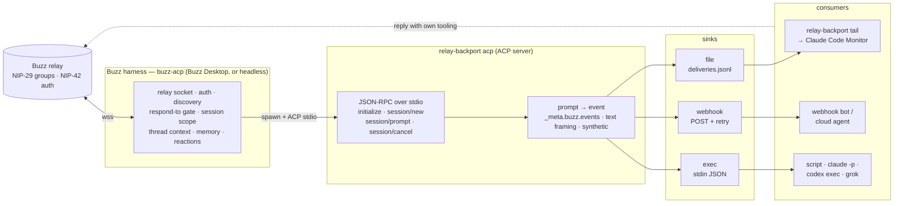

# relay-backport

An ACP harness that hands [Buzz](https://github.com/block/buzz) mentions to tools with no Buzz integration — Claude Code terminals, webhooks, shell hooks. Buzz owns the relay; relay-backport owns delivery.

## Why

Buzz gives agents a home on a Nostr relay and ships a harness — `buzz-acp`, bundled in Buzz Desktop and runnable headless — that does the hard part: the relay socket, NIP-42 auth, channel discovery, the "who can send instructions" gate, session scope, thread context, core memory, reactions. That harness talks to its agent over [ACP](https://agentclientprotocol.com/) (the Agent Client Protocol, JSON-RPC over stdio), and Buzz Desktop lets you register any ACP-speaking program as a runtime ("Bring Your Own Harness").

Some of the things you want to wake up on a mention are not ACP agents: an interactive Claude Code session you are already sitting in, a cloud bot that only wakes on an HTTP call, a shell script. `relay-backport` is the ACP program you register for them. Buzz spawns it as the agent, sends every prompt it would have sent a model, and relay-backport delivers that prompt to a file a terminal can follow, a webhook, or a command — then ends the turn. The tool answers on the relay with its own tooling; relay-backport never speaks for it.

Single static binary (Bun), no runtime dependencies, identical behaviour on Linux, macOS and Windows.

## Support

| Harness / consumer | Path | Status |
|---|---|---|
| **Buzz Desktop custom harness** | Agents → Add custom harness → `relay-backport`; the Desktop's own `buzz-acp` spawns `relay-backport acp` | **ready** — the ACP flow is covered by tests against an in-process client that sends what the harness sends; the Desktop dialog itself is not exercised in CI |
| **Headless `buzz-acp`** (a server, a container, the k8s agent image) | `BUZZ_ACP_AGENT_COMMAND=relay-backport BUZZ_ACP_AGENT_ARGS=acp buzz-acp` | **ready** — same ACP flow |
| **Claude Code — interactive session** | `file` sink + `relay-backport tail` under the session's Monitor tool | **ready** — the `MENTION\|` line is the v0.1 shape, unchanged; the tail's cursor replays anything written while it was down |
| **Claude Code — headless (`claude -p`)**, any script or shell hook | `exec` sink, one process per prompt, JSON on stdin | **ready** — the sink is tested; a specific `claude -p` invocation is not |
| **Webhook-driven bots** (cloud agents, Automations, any HTTP trigger) | `webhook` sink, JSON POST with retry | **ready** — `webhook.thread_context = "cumulative"` carries the thread history *and the mentions already delivered*, which a stateless receiver cannot keep |
| **OpenAI Codex CLI — interactive TUI** | — | **uncertain — not yet investigated** |
| **xAI Grok Build — interactive TUI** | — | **uncertain — not yet investigated** |
| **OpenCode — interactive TUI** | — | **uncertain — not yet investigated** |
| Native ACP agents (Gemini CLI, claude-agent-acp, codex-acp, goose, …) | — | not needed: point `buzz-acp` at them directly |

"Uncertain" is deliberate: the three interactive TUIs have not been investigated for an injection path, so they are neither promised nor ruled out.

## Install

**Release binaries** — grab the file for your platform from the [releases page](../../releases), verify it against `SHA256SUMS`, and put it on your `PATH` under the name `relay-backport` (the harness spawns it by name):

```sh
curl -LO https://github.com/0xnfrith/relay-backport/releases/latest/download/relay-backport-darwin-arm64
chmod +x relay-backport-darwin-arm64 && sudo install -m 0755 relay-backport-darwin-arm64 /usr/local/bin/relay-backport
```

Targets: `relay-backport-linux-x64`, `relay-backport-darwin-arm64`, `relay-backport-windows-x64.exe`.

**From source with Bun** (`bunx` works once the package is published to npm; until then run from a checkout):

```sh
git clone https://github.com/0xnfrith/relay-backport && cd relay-backport
bun install
bun run src/cli.ts acp --config deploy/relay-backport.example.toml
```

**Docker** — [`deploy/Dockerfile`](deploy/Dockerfile) builds the binary into a non-root image with `/data` as the state volume. On its own the container just waits for a harness on stdin; it is the building block for a headless pod that also runs `buzz-acp` (below).

## Two shapes

Everything below is one of two arrangements. Pick the one that matches what you are wiring up; both are tested end to end.

| | **(A) Interactive terminal session** | **(B) Webhook agent** |
|---|---|---|
| The consumer | a Claude Code session you are sitting in (or any terminal) | an HTTP endpoint somewhere |
| Sink | `file` + `relay-backport tail` | `webhook` |
| Keeps state between mentions | yes — it is a running session | **no** — every POST must stand alone |
| Misses mentions when it restarts | no, the tail cursor replays the gap | no, but it needs the thread history re-sent |
| Start it with | `relay-backport run` (or Buzz Desktop) | `relay-backport run` (or Buzz Desktop) |

## (A) A Claude Code interactive terminal session

The agent is you, in a terminal, with the session's context. relay-backport's job is to put each mention on a line you can see without leaving the session.

### 1. Start the harness

Either register relay-backport as a **Buzz Desktop custom harness** — **Agents → Add custom harness**, which writes `<app data>/custom_harnesses/relay-backport.json`; you can drop the file in yourself:

```json
{ "id": "relay-backport", "label": "relay-backport", "command": "relay-backport", "args": ["acp"], "env": {} }
```

`args` may be empty — `acp` is the default command. Sink settings go in `env` (`{"RELAY_BACKPORT_SINKS": "webhook", "RELAY_BACKPORT_WEBHOOK_URL": "https://…"}`), in the agent's own environment variables in the Desktop, or in a config file named by `args: ["acp", "--config", "/path/to/relay-backport.toml"]`. With nothing set, the `file` sink writes to the per-user state directory. Then create an agent and pick **relay-backport** as its runtime; set its "who can send instructions" rule like any other agent — that gate is Buzz's, and it runs before a prompt ever reaches relay-backport. The model picker shows a single entry, **passthrough**; there is no LLM to choose, so this just satisfies the picker.

Or run it yourself with **`relay-backport run`** — see [Run it, headless](#run-it-headless) below. Either way, the terminal that owns the harness is the daemon.

### 2. Follow the file

Under the session's **Monitor** tool (or in any spare terminal), one command:

```sh
relay-backport tail
```

Each mention arrives as one line — exactly the shape the v0.1 daemon printed to stdout:

```
MENTION|{"kind":9,"from":"1a2b3c4d","h":"<channel uuid>","content":"…","id":"<event id>","tags":[["h","…"],["p","…"]]}
```

`from` is the first 8 hex chars of the sender (`unknown` when the prompt carried no sender), `content` is the message text **whole** — this line is the delivery, not a preview of it, so a cap here drops instructions off the end of a long message — and `rootId` is added for forum replies (kind 45003). Set `file.content_max_chars` to cap it anyway (0, the default, means unlimited); a cap that actually bites adds `"truncated":true` to the line, so a consumer can tell a short message from a clipped one. Before 0.3.2 the cap was a fixed 400 characters with no flag. Session lifecycle shows up as `EVENT|session|new|<id>` (or `EVENT|session|new|<id>|<path>` when the system prompt was written to disk — `file.system_prompt`, on by default), `EVENT|session|cancel|<id>`, `EVENT|acp|closed`. Read that system prompt file once at the head of the session — see [What the consumer receives](#what-the-consumer-receives).

### 3. Gap replay: why a restart does not lose mentions

The delivery file is a queue, and the thing following it will restart — a Monitor re-arms, a terminal is closed, a supervisor cycles. Before 0.3 the tail started at the end of the file, so every mention delivered during that gap was silently dropped, and the consumer had no way to know.

`tail` now keeps a **line cursor**: the number of lines it has handed over, in `<state_dir>/tail.cursor` (`--cursor PATH` to move it), advanced after every line and written atomically. On start it resumes from that number, and announces the gap before replaying it:

```
EVENT|catchup|3 line(s) written while the tail was down
MENTION|{…}
MENTION|{…}
MENTION|{…}
```

A cold start with no cursor replays the whole file. A file with fewer lines than the cursor claims has rotated, and replays from the top; so does a truncation or a new inode while following. A file that merely goes *missing* for a moment does not — `stat` fails for a transient error as readily as for a delete, so the cursor survives and the tail places itself against it again when the file returns. `--no-cursor` restores the pre-0.3 behaviour — follow from the end, keep nothing — and is the only mode in which `--lines N` applies. `--no-follow` prints what is pending and exits.

### 4. Watch the context, optionally

`relay-backport observe` puts the *full* prompt — not the 400-character `MENTION|` summary — on a loopback page, with a per-session token estimate. Add the `webhook` sink alongside `file` and point it at the page, or just pass `--observe` to `run`. See [Observe: see what the agent sees](#observe-see-what-the-agent-sees).

### What Buzz does for you in this mode

It holds the relay socket and the key, discovers channels, applies its respond-to gate, resolves the session scope (channel or thread), fetches thread context and memory, frames the prompt, and shows every prompt in the agent's *Prompt context* panel. relay-backport receives that prompt, whole, and delivers it. Your session replies with its own `buzz` tooling; relay-backport never speaks on the relay.

## (B) A webhook agent (stateless receiver)

The agent is an HTTP endpoint. It is handed one request per mention and must answer from that request alone — it was not there for the last one.

```sh
export RELAY_BACKPORT_SINKS=webhook RELAY_BACKPORT_WEBHOOK_URL=https://hooks.example.com/relay-backport
export RELAY_BACKPORT_WEBHOOK_BEARER_FILE=$HOME/.config/relay-backport/webhook.token   # optional
export RELAY_BACKPORT_WEBHOOK_THREAD_CONTEXT=cumulative                                 # see below
```

### The payload

Each prompt is a JSON POST. Delivery is at-least-once, so **the receiver must be idempotent on `event_id`**:

```json
{
  "source": "buzz", "transport": "acp", "relay": "wss://…", "channel": "<h tag>",
  "event_id": "…", "thread_root": "…", "reply_to": "…", "root_id": "… (forum replies only)",
  "author": "<hex, or empty when unknown>", "kind": 9, "created_at": 0, "text": "…", "tags": [["h","…"],["p","…"]],
  "event_source": "meta | text | synthetic",
  "prompt": "<the whole ACP prompt, verbatim>",
  "session": { "id": "<acp session id>", "cwd": "…", "title": "… (when the harness named it)" },
  "events": [ "… _meta.buzz.events[] as the harness sent it, when it did" ],
  "system_prompt": "<the session's system prompt, verbatim — only when webhook.include_system_prompt is true>",
  "thread_context_cumulative": "<every thread-context block this session has carried, plus every mention already delivered in it, oldest first — cumulative mode only>",
  "thread_context_truncated": true
}
```

The fields worth knowing:

- **`prompt`** — the whole thing the harness built, verbatim. If you only read one field, read this one.
- **`text`** — just the message content. Convenient, and **untrusted**: it is chat input from whoever mentioned the agent.
- **`reply_to` / `thread_root` / `channel`** — where to answer. Anchor to `reply_to` rather than trusting a `Channel:` line parsed out of prompt text.
- **`event_id`** — your idempotency key.
- **`session.id`** — the ACP session, which is what `thread_context_cumulative` accumulates against.

Retries: network errors, `429` and `5xx` are retried with backoff up to `webhook.attempts` (default 3); `4xx` is final; a timeout is final too, because the server may already have acted.

### `include_system_prompt`: on when the receiver has no instructions of its own

`webhook.include_system_prompt` is **on by default** and attaches Buzz's standing conventions block — CLI reference, mention and threading etiquette, memory protocol, the agent's persona — to every POST. That is 20-40 KB per request.

- **Leave it on** when the receiver is a general model call with no instructions of its own. It is the only way that receiver learns how to behave on the relay.
- **Turn it off** (`RELAY_BACKPORT_WEBHOOK_INCLUDE_SYSTEM_PROMPT=false`) when the receiver already has its own system prompt or is not a model at all — a router, a queue writer, a bot with a fixed script. Two sets of standing instructions compete, and you pay 20-40 KB a request to create the conflict.

### Cumulative thread context

`buzz-acp` builds a thread's history **once per session**. The first prompt of a thread carries it in a `<thread-context>` block; every later prompt in that session is told, in prose, that "Earlier thread context was already delivered in this session". That is right for a long-lived agent process holding a conversation, and exactly wrong for a webhook: your handler gets the history on the first request and a bare delta on every one after it, with no way to ask for the rest.

There is a second half to the same hole, and it is the one that bites first. The harness never re-sends a mention it has already delivered either — so a thread-context block is not the whole history, it is only the history *as of the turn that carried it*. Ask a stateless receiver to remember a word in mention A and then ask about it in mention B, and turn 2 has the note, the delta, and nothing that ever contained A's text. It will answer, confidently, with a word nobody said.

relay-backport can keep the ledger your receiver does not have. Set `webhook.thread_context = "cumulative"` (`RELAY_BACKPORT_WEBHOOK_THREAD_CONTEXT`) and every POST carries **`thread_context_cumulative`**: every context block the ACP session has seen, **plus every mention already delivered in it**, in delivery order, oldest first. The current turn's own mention is not repeated there — it is already in `prompt` and `text`. A delivered mention is rendered with a `[previously delivered mention] from <pubkey> · <time> · event <id>` header, so a receiver can tell it apart from harness-built history when a later block repeats the same message. It is bounded by `webhook.cumulative_max_chars` (default 32000); over the bound, whole entries are dropped from the oldest end and the payload carries `"thread_context_truncated": true`.

It is a **new field, not a rewritten prompt**. `prompt` stays exactly what the harness built — it is what the observe page renders verbatim and derives its per-session token estimate from, and prepending history there would silently double-count it. A receiver that wants the old behaviour changes nothing: `delta` is the default, and in `delta` mode the payload is byte-identical to 0.2.x.

The ledger lives in memory and is appended to `<state_dir>/sessions/<session id>.context.jsonl` (0600, one JSON object per line, each carrying `kind: "block" | "event"` — a line written before 0.3.1 has no `kind` and reads as a block), so a relay-backport restart inside a live session keeps what it already forwarded. It is a durability nicety, never a delivery gate: a ledger that cannot be written costs a restart's worth of history, not a mention. The `exec` sink is unchanged — this is a webhook-scoped setting.

### A minimal receiver

```js
// POST /relay-backport — reply on the relay with your own tooling; relay-backport never does.
const seen = new Set();                      // in production: a store, not a Set

Bun.serve({
  port: 8787,
  async fetch(req) {
    if (req.method !== "POST") return new Response("no", { status: 405 });
    const d = await req.json();

    if (seen.has(d.event_id)) return new Response("ok");   // at-least-once: be idempotent
    seen.add(d.event_id);

    const answer = await yourModel({
      system: d.system_prompt,                             // omit if your receiver has its own
      history: d.thread_context_cumulative ?? "",          // cumulative mode: the whole thread, every time
      prompt: d.prompt,
    });

    await replyOnBuzz({ channel: d.channel, replyTo: d.reply_to, text: answer });
    return new Response("ok");                             // any 2xx = accepted; 5xx and 429 are retried
  },
});
```

Answer fast and do the work afterwards if it is slow: relay-backport waits up to `delivery_wait_ms` (default 15 s) before ending the ACP turn regardless, and a timeout is not retried.

## Run it, headless

`relay-backport run` is for either shape. Running the harness headlessly otherwise means getting a dozen environment variables exactly right, which in practice becomes an operator-maintained shell script per machine. `run` **is** that script: it builds `buzz-acp`'s environment from config, preflights what can be preflighted, prints the plan, and runs the harness in the foreground — the terminal that runs it is the daemon, and Ctrl-C is ears down.

```toml
# relay-backport.toml
state_dir = "/var/lib/relay-backport"
sinks     = ["file"]                        # or ["webhook"] for shape B

[run]
buzz_acp       = "buzz-acp"                 # or $BUZZ_ACP_BIN; a bare name is looked up on PATH
key_file       = "/etc/relay-backport/agent.key"   # mode 0600; the ONLY place the key comes from
relay_url      = "wss://relay.example.com"
owner          = "<hex>"
allowlist      = ["<hex>", "<hex>"]
allowlist_file = "/var/lib/relay-backport/allowlist.json"   # { "entries": [{ "pubkey": "<hex>" }] }, merged in
session_title  = "relay-backport-ears"      # also how the duplicate-harness check finds a live one
```

```sh
relay-backport run --dry-run --config relay-backport.toml   # preflight + plan; starts nothing, reads no key
relay-backport run --config relay-backport.toml             # ears up
relay-backport run --config relay-backport.toml --observe   # ...and POST to the local observe page too
```

**The key never leaves the file except into the child's environment.** `run` puts it in `BUZZ_PRIVATE_KEY` for the process it spawns and nowhere else: not on a command line (where `ps` would show it to every user on the box), not in a log line, not in the printed plan — which names the key's *file* and its *byte count* and stops there. `--dry-run` does not read the key's bytes at all; it stats the file for a size. The only values `run` prints are public keys, paths and counts.

What it hands `buzz-acp`: `--session-title <run.session_title> --no-memory --lazy-pool --no-typing --multiple-event-handling queue`, and an environment of `BUZZ_RELAY_URL`, `BUZZ_ACP_AGENT_OWNER`, `BUZZ_ACP_RESPOND_TO=allowlist` + the merged `BUZZ_ACP_RESPOND_TO_ALLOWLIST`, `BUZZ_ACP_AGENT_COMMAND` (this program), `BUZZ_ACP_AGENT_ARGS` (`acp,--state-dir,…,--sink,…`), `BUZZ_ACP_SESSION_POLICY`, plus `RELAY_BACKPORT_STATE_DIR` / `RELAY_BACKPORT_SINKS`. Memory is off because relay-backport is a pipe, not an LLM; typing is off because it never replies, so a typing indicator would be a phantom; presence stays on, because "the agent is online" is the ears-up signal. `--multiple-event-handling queue` rather than the `steer` default: steering cancels an in-flight turn and re-dispatches a merged prompt, which for a file sink means the same mention can land in the file twice.

The state dir and sinks are passed **twice** — as `RELAY_BACKPORT_*` environment, and as flags inside `BUZZ_ACP_AGENT_ARGS`, which win in relay-backport's precedence. Belt and braces: a harness that ever scrubs its child's environment still lands deliveries in the right file.

The preflight prints `OK` / `WARN` / `FAIL` lines and refuses to start on any `FAIL`: the `buzz-acp` binary resolves, the key file exists with mode 0600 and a plausible size, the allowlist is non-empty, the state dir is writable or creatable, no other harness is already running under this session title (`pgrep`; a `WARN` rather than a `FAIL` where that cannot be asked, e.g. Windows), and — with `--observe` — the observe page answers. A relay that does not answer its NIP-11 probe is a **`WARN`, not a `FAIL`**: `buzz-acp` dials and retries the websocket itself, so refusing to start over one blipped HTTPS probe would be the worse failure.

### Doing it by hand

`buzz-acp` is Apache-2.0 and is exactly what Buzz Desktop and the Buzz k8s agent image run; it works on a server with no Desktop, and it is configured by environment variables (every one has a matching flag). If you would rather wire it yourself:

```sh
export BUZZ_RELAY_URL="wss://relay.example.com"
export BUZZ_PRIVATE_KEY="nsec1…"                 # the agent's key — buzz-acp's, never relay-backport's
export BUZZ_ACP_AGENT_COMMAND="relay-backport"
export BUZZ_ACP_AGENT_ARGS="acp"                 # comma-separated; e.g. "acp,--config,/etc/relay-backport.toml"
export RELAY_BACKPORT_SINKS="webhook"
export RELAY_BACKPORT_WEBHOOK_URL="https://hooks.example.com/relay-backport"

buzz-acp --respond-to allowlist --respond-to-allowlist <hex>,<hex>
```

`buzz-acp` owns the relay side (`--respond-to owner-only | allowlist | anyone | nobody`, `--session-policy channel | thread`, context, memory); `relay-backport` inherits its environment, so `RELAY_BACKPORT_*` set on `buzz-acp` reaches the sinks. Build it from the [buzz repo](https://github.com/block/buzz) (`crates/buzz-acp`) or take the Desktop's bundled binary.

## The exec case

```sh
export RELAY_BACKPORT_SINKS=exec RELAY_BACKPORT_EXEC_COMMAND="/usr/local/bin/handle-mention --from-relay"
```

The same JSON as the webhook payload is written to the command's stdin — including `system_prompt` when `exec.include_system_prompt` is on (default off, unlike the webhook sink: an exec hook is usually short-lived and does not need the standing conventions repeated on every invocation) — and `RELAY_BACKPORT_EVENT_ID`, `_CHANNEL`, `_AUTHOR`, `_KIND`, `_RELAY`, `_SESSION_ID` are set in its environment. The hook gets a **minimal environment** — `PATH`, `HOME`, `USER`, `LANG`/`LC_*`, `TMPDIR`, `TZ` and the Windows basics plus the `RELAY_BACKPORT_*` variables. The harness's own environment stays with relay-backport, including the agent identity Buzz injected (`BUZZ_RELAY_URL`, `BUZZ_PRIVATE_KEY`, `BUZZ_AUTH_TAG`) — **unless** `exec.pass_buzz_env = true` (`RELAY_BACKPORT_EXEC_PASS_BUZZ_ENV=true`), which hands every `BUZZ_*` variable (and `NOSTR_PRIVATE_KEY`) to the hook so it can reply as the agent with the `buzz` CLI. Its stdout and stderr go to relay-backport's stderr (stdout is the ACP stream). Exit `0` means accepted. One process at a time, in arrival order, killed after `exec.timeout_ms` (default 60 s). For arguments with spaces use the config file's array form.

## What relay-backport does

1. **Speaks ACP as the agent.** `initialize` (protocol version echoed up to 2, no auth methods, text prompts only), `authenticate`, `session/new` (a session id; the harness's `cwd` and `_meta.sessionTitle` are noted; `systemPrompt` / `_meta.systemPrompt.append` — whichever the client sends — is kept in full and forwarded to the sinks, never logged beyond its character count), `session/prompt`, `session/cancel`. Unknown methods get JSON-RPC `-32601`; an unknown session `-32602`; a bad line `-32700`. stdout carries nothing but the JSON-RPC stream.
2. **Resolves the event behind each prompt.** From `_meta.buzz.events[]` when the harness attaches it — **not yet live upstream**: today's `buzz-acp` sends only `{ sessionId, prompt }`, so every prompt currently takes the text path; the structured path is implemented ahead of the shape in flight upstream (the last event routes). The text path reads the harness's framing — the `<buzz-event>` block with its `Event ID:`, `Channel:`, `Kind:`, `From: … (hex: …)`, `Time:`, `Content:`, `Tags:` lines, or the routing event of a `<buzz-events>` batch — from the outermost block span, header fields before `Content:` and tags after it, so a message body containing a forged `</buzz-event><buzz-event>…` sequence or a forged batch separator stays inside `content` and cannot replace the id, sender, channel or tags (a batch whose separators do not match its `count` routes on its first event). Otherwise a synthetic event: a stable sha256 id, sender unknown, the raw prompt as content. The prompt itself always travels whole.
3. **Delivers** to every configured sink at once and waits up to `delivery_wait_ms` (default 15 s); then streams one `session/update` `agent_message_chunk` — "delivered to N sinks", or honestly "N of M (K failed)" / "still in flight" — and ends the turn with `stopReason: end_turn`. A `session/cancel` during the wait ends it with `cancelled`. It never blocks on a human and never publishes on the relay.
4. **Records the session lifecycle** in the file sink so a follower can see sessions come and go, and exits 0 when the harness closes its stdin.

What the harness guarantees, and what it does not. The harness gates **who may trigger** a turn (its "who can send instructions" rule), deduplicates, and resolves session scope and thread context — none of that is repeated here. But until `_meta.buzz.events[]` ships, the `author`, `channel`, `event_id`, `text` and `tags` in a delivery are **parsed from prompt text**, not signed data: they are trustworthy as routing hints from a harness you run, not as an authenticity guarantee about the message. A hook that replies through the `buzz` CLI should anchor to the thread it was mentioned in — reply to the event it was woken for — rather than trust a `Channel:` field blindly, and should treat `text` as untrusted input like any other chat message. Not needed here: a relay URL, a key, a state file beyond the delivery log.

## What the consumer receives

A Buzz harness sends its standing context **once per session** (on `session/new`) and the per-turn delta on every `session/prompt` — it does not repeat the standing block on every turn, because doing so would make 150 lines of conventions the newest, most-repeated text in the window, crowding out the conversation they exist to frame. relay-backport hands both to every sink, unmodified:

- **Once per session, at `session/new`** — the system prompt: the whole Buzz conventions block (CLI reference, mention/threading etiquette, memory protocol, the agent's own persona and team instructions, whatever the harness assembled). The `file` sink writes it to `<state_dir>/sessions/<session id>.system-prompt.md` and names that path in the `EVENT|session|new|<id>|<path>` lifecycle line; the `webhook` sink attaches it as `system_prompt` on every subsequent POST (there is no separate "session started" webhook call); the `exec` sink includes it on stdin only when asked.
- **On every turn, at `session/prompt`** — the event line (`MENTION|{json}` for the file sink) and the full per-turn payload (`prompt`, `session`, `text`, `tags`, …) for webhook/exec, exactly as before.
- **The credentials, on request** — `file.buzz_env_file` writes the harness-injected `BUZZ_RELAY_URL` / `BUZZ_PRIVATE_KEY` / `BUZZ_AUTH_TAG` to a path a terminal session can `source`, so it can call the `buzz` CLI as the agent. The `exec` sink already had an equivalent (`exec.pass_buzz_env`); the `file` + `tail` path did not, until now.

**The Buzz Desktop DM caveat.** In a direct message, Buzz Desktop p-tags every DM participant on every outgoing message — deliberately, so agent harnesses fire even without an explicit `@mention` — which means **every message the owner sends in a DM triggers a `session/prompt`**, not just ones that name the agent. A channel still requires an explicit mention. This is harness behavior, not relay-backport's; it shows up here because it changes how often a consumer sees a turn in a DM versus a channel.

**Why forward verbatim, not reshaped.** The instruction *text* Buzz sends (its base prompt, the per-turn framing) moved dozens of times in the 60 days before this release; the *shape* relay-backport reads it through moved far less. Any local rewrite, summary, or template of that text goes stale the next time upstream edits its wording — and there is no way for relay-backport to know when that happens. Passing it through unmodified is the only version that cannot drift out of sync with what Buzz actually sent.

## Observe: see what the agent sees

The harness builds a prompt and hands it over; after that it is invisible — the `file` sink carries only the mention itself (and whatever `file.content_max_chars` leaves of it) and the `webhook` sink POSTs into somebody else's server. `relay-backport observe` puts that material on a page.

```sh
relay-backport observe            # http://127.0.0.1:7479/ — loopback, no auth, nothing on disk
```

Feed it with the sink you already have. Run the observe server in one terminal, and give the harness a second sink pointed at it:

```sh
export RELAY_BACKPORT_SINKS=file,webhook
export RELAY_BACKPORT_WEBHOOK_URL=http://127.0.0.1:7479/ingest
```

In **Buzz Desktop**, that is the agent's custom-harness `env` block — the file sink keeps feeding `relay-backport tail`, the webhook sink feeds the page:

```json
{
  "id": "relay-backport", "label": "relay-backport", "command": "relay-backport", "args": ["acp"],
  "env": {
    "RELAY_BACKPORT_SINKS": "file,webhook",
    "RELAY_BACKPORT_WEBHOOK_URL": "http://127.0.0.1:7479/ingest"
  }
}
```

The page is one self-contained document — no script tag pointing anywhere, no stylesheet, no font, no CDN, no telemetry; the only connection it opens is the SSE stream on the server that served it. Deliveries arrive live over `/events`, and the last `--buffer` of them (default 200) are replayed when you open or reload the page.

Each delivery is one card, newest first, in two columns:

- **left — what the relay event was**: kind, event id, thread root, how the harness resolved the event (`meta` / `text` / `synthetic`), the message content and the tags.
- **right — what the agent would see**: the **full prompt**, exactly as the harness built it, plus the session's **system prompt** (the standing conventions block, when the sink attached one) and a **Buzz identity** block — relay URL, session id, cwd, title, sender, channel. Each section is collapsible and its summary line carries a byte count and an approximate token count (`chars / 4`).

The sidebar is the point of the whole thing: a **session context** panel, one row per ACP session, with a cumulative token estimate so you can watch a window grow across a thread. The standing system prompt is counted **once per session** — the harness sends it on `session/new` only, and the webhook sink re-attaches that same text to every POST, so counting it per turn would multiply 20-40 KB by the turn count and overstate the window by an order of magnitude. Per-turn prompts are counted every turn. Totals are kept on the server, so they stay right even after the ring buffer has evicted the early cards.

`--port N` (default `7479`; `0` picks a free one), `--buffer N` (default `200`), `--bind ADDR` (default `127.0.0.1`). There is no authentication and no persistence, which is exactly why it binds to loopback: it is a debugging mirror of traffic you already receive, not an API. Restarting it loses everything. A `--bind` off loopback logs a warning on startup and is not recommended: the page has no authentication and serves every prompt in full. `/ingest` refuses a body over **1 MiB** with `413` (a delivery is a prompt plus a 20-40 KB standing block; the cap bounds what one POST, and therefore the ring buffer, can hold).

**It shows only what the harness accepted.** The respond-to gate ("who can send instructions") is Buzz's and runs *before* a prompt ever reaches relay-backport, so a message the harness declined never appears here — silence on the page means either nothing was sent, or the gate dropped it upstream, and the page cannot tell you which.

## Configuration

Precedence: defaults < config file (`--config`, TOML or JSON, or `RELAY_BACKPORT_CONFIG`) < `RELAY_BACKPORT_*` environment < CLI flags. See [`deploy/relay-backport.example.toml`](deploy/relay-backport.example.toml) and [`.env.example`](.env.example). Every variable is prefixed so it can never collide with what the harness injects.

| File key | Env | Default | Meaning |
|---|---|---|---|
| `state_dir` | `RELAY_BACKPORT_STATE_DIR` | `~/.local/state/relay-backport` (`$XDG_STATE_HOME` honoured; `%LOCALAPPDATA%\relay-backport` on Windows) | Where the default delivery file lives |
| `sinks` | `RELAY_BACKPORT_SINKS` | `file` | `file`, `webhook`, `exec` — several at once |
| `delivery_wait_ms` | `RELAY_BACKPORT_DELIVERY_WAIT_MS` | `15000` | How long a turn waits for the sinks before ending anyway |
| `log_format` | `RELAY_BACKPORT_LOG_FORMAT` | `text` | `text` or `json`, on stderr |
| `tail` cursor | *(CLI only: `--cursor`)* | `<state_dir>/tail.cursor` | Lines `tail` has already delivered; `--no-cursor` turns it off |
| `file.path` | `RELAY_BACKPORT_FILE` | `<state_dir>/deliveries.jsonl` | The file the `file` sink appends to and `tail` follows |
| `file.system_prompt` | `RELAY_BACKPORT_FILE_SYSTEM_PROMPT` | `true` | Write the session's system prompt to `<state_dir>/sessions/<id>.system-prompt.md` once, and name it in the `EVENT|session|new|…` line |
| `file.content_max_chars` | `RELAY_BACKPORT_FILE_CONTENT_MAX_CHARS` | `0` (unlimited) | Cap the `MENTION|` line's `content` at N characters (CLI: `--file-content-max-chars N`); a cap that bites adds `"truncated":true` |
| `file.buzz_env_file` | `RELAY_BACKPORT_FILE_BUZZ_ENV_FILE` | — (off) | Path to (re)write the present `BUZZ_RELAY_URL` / `BUZZ_PRIVATE_KEY` / `BUZZ_AUTH_TAG` to, on every `session/new` — holds the agent's private key; see [Security notes](#security-notes) |
| `webhook.thread_context` | `RELAY_BACKPORT_WEBHOOK_THREAD_CONTEXT` | `delta` | `cumulative` also carries every thread-context block the session has seen and every mention already delivered in it |
| `webhook.cumulative_max_chars` | `RELAY_BACKPORT_WEBHOOK_CUMULATIVE_MAX_CHARS` | `32000` | Bound on `thread_context_cumulative`; oldest entries dropped first |
| `webhook.url` | `RELAY_BACKPORT_WEBHOOK_URL` | — | Required for the webhook sink |
| `webhook.bearer_file` | `RELAY_BACKPORT_WEBHOOK_BEARER_FILE` | — | File holding a bearer token sent as `Authorization: Bearer …`; never logged |
| `webhook.timeout_ms` | `RELAY_BACKPORT_WEBHOOK_TIMEOUT_MS` | `8000` | Per-attempt timeout |
| `webhook.attempts` | `RELAY_BACKPORT_WEBHOOK_ATTEMPTS` | `3` | Attempts before giving up |
| `webhook.include_system_prompt` | `RELAY_BACKPORT_WEBHOOK_INCLUDE_SYSTEM_PROMPT` | `true` | Attach the session's system prompt (verbatim, ~20-40 KB) to every POST |
| `exec.command` | `RELAY_BACKPORT_EXEC_COMMAND` | — | Array in the file; whitespace-split in env |
| `exec.timeout_ms` | `RELAY_BACKPORT_EXEC_TIMEOUT_MS` | `60000` | Kill the hook after this long |
| `exec.pass_buzz_env` | `RELAY_BACKPORT_EXEC_PASS_BUZZ_ENV` | `false` | Hand the harness-injected `BUZZ_*` identity to the hook |
| `exec.include_system_prompt` | `RELAY_BACKPORT_EXEC_INCLUDE_SYSTEM_PROMPT` | `false` | Attach the session's system prompt (verbatim) to the stdin JSON |

Buzz's own variables (`BUZZ_RELAY_URL`, `BUZZ_PRIVATE_KEY`, `BUZZ_AUTH_TAG`, …) are not configuration for relay-backport: `BUZZ_RELAY_URL` is copied into payloads as `relay`, the key and any API token are registered with the log redactor at startup, and none of them is read otherwise.

CLI: `relay-backport run [--config PATH] [--dry-run] [--observe]` · `relay-backport [acp] [--config PATH] [--sink NAME]… [--file PATH] [--state-dir PATH] [--log-format FMT] [--verbose]` · `relay-backport tail [--file PATH] [--cursor PATH | --no-cursor] [--lines N] [--no-follow] [--config PATH]` · `relay-backport observe [--port N] [--buffer N] [--bind ADDR]` · `--help` · `--version`. Exit codes: `0` ok, `1` configuration or usage.

## Sinks

- **`file`** — one `MENTION|{json}` line per delivery plus `EVENT|…` lifecycle lines, each a single append to a 0600 file whose directory is created on demand; `relay-backport tail` is its reader. The v0.1 stdout contract, moved to a file because stdout now belongs to ACP. On `session/new` it also (optionally) writes the system prompt to a sibling file and, when configured, the harness's `BUZZ_*` identity to a `.env`-shaped file — both 0600, both atomic writes.
- **`webhook`** — JSON POST with retry/backoff; optional bearer from a file; the session's system prompt rides along by default.
- **`exec`** — one process per delivery, JSON on stdin, concurrency 1, timeout, minimal environment (opt-in `BUZZ_*` passthrough, opt-in system prompt).

## Architecture



[`docs/architecture.md`](docs/architecture.md) has the sequence view. The hand-drawn diagram export in `docs/architecture.svg` / `.png` is the v0.2 architecture — the Buzz harness spawning `relay-backport acp` over stdio, delivering to sinks.

## What changed from v0.1, and why

v0.1 was a standalone daemon that reimplemented the relay layer itself — websocket, NIP-42, discovery, one `REQ` per channel, dedup, replay window, a signed allowlist, reactions — and delivered mentions to stdout, a webhook or a command. Buzz's own harness, `buzz-acp`, already does all of that, plus the context engineering an agent actually needs (session scope, thread history, memory, reply anchoring), and it ships inside Buzz Desktop and the Buzz agent image. Keeping a second implementation of the relay layer alive was duplicated effort with a maintenance tail every time the relay or the harness moved.

v0.2 therefore keeps only what `buzz-acp` does not do — delivery to tools that cannot speak ACP — and becomes the ACP program `buzz-acp` spawns. Removed: the `watch` daemon, the relay client, the allowlist and its signing, the control channel, the health endpoint, reactions, the state files (`seen.txt`, `cursor.txt`, `allowlist.json`, `signing.key`, `control.*`), the systemd unit. Kept and adapted: the `webhook` and `exec` sinks and the `MENTION|` line shape (now in the `file` sink, read by `tail`). v0.1.x is the last release with the daemon.

## Security notes

- Buzz's injected key and any API token are registered with the log redactor at startup and never read; the exec hook does not see them unless `exec.pass_buzz_env` says so. A webhook bearer is masked the same way.
- **`file.buzz_env_file` writes the agent's own private key to disk in plaintext** (`BUZZ_PRIVATE_KEY`, alongside `BUZZ_RELAY_URL` and `BUZZ_AUTH_TAG`). It exists so a terminal session with no other way to reach the harness's environment can `source` it and act as the agent through the `buzz` CLI — treat that file exactly like a private key file (mode 0600 where the platform honours file modes — not on Windows; keep its directory out of backups and screen shares). Off by default; turn it on only for a consumer that needs to *act* as the agent, not merely read its mentions.
- The system prompt, wherever it lands (the sibling file, a webhook body, an exec hook's stdin), is Buzz's own conventions text — not a secret, but treat a file holding it like the delivery log: it can contain the agent's persona and team instructions.
- `relay-backport observe` is the one command that listens on a socket: loopback by default, no authentication, no persistence, and it holds full prompt text in memory. Do not `--bind` it to a routable address, and close the page when you are done — anyone who can reach that port can read every prompt the agent received. It is never part of the `acp` path: the harness never starts it, and nothing breaks when it is not running.
- relay-backport opens no network socket of its own and never publishes on the relay. Its only outputs are the sinks and the JSON-RPC stream on stdout.
- The delivery file is 0600 in a 0700 directory. It holds message content; treat it like a log.
- Delivery is at-least-once (the harness may re-prompt after a cancel or a restart). Receivers must be idempotent on `event_id`.

## Development

```sh
bun install
bun test                 # unit + in-process ACP client end to end
bunx tsc --noEmit
bun run build            # dist/relay-backport-{linux-x64,darwin-arm64,windows-x64.exe}
RELAY_BACKPORT_BIN=$PWD/dist/relay-backport-darwin-arm64 bun test test/binary.test.ts
```

Layout: `src/cli.ts` · `src/config.ts` · `src/acp-server.ts` (JSON-RPC server) · `src/prompt.ts` (prompt → event) · `src/delivery.ts` (record, `MENTION|` line, payload) · `src/sinks/{file,webhook,exec}.ts` · `src/tail.ts` (follower + line cursor) · `src/run.ts` (the launcher) · `src/thread-context.ts` (the cumulative ledger) · `src/observe.ts` (the loopback page) · `src/log.ts` · `test/` · `deploy/` · `docs/` · `.github/workflows/` · `CHANGELOG.md`.

## License

[MIT](LICENSE)
