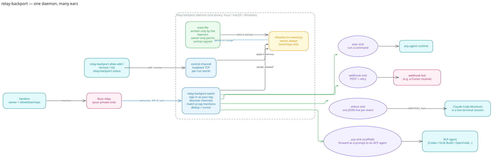
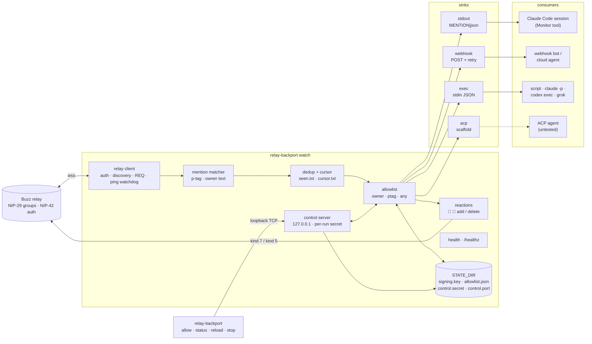

# relay-backport

Ears on a [Buzz](https://github.com/block/buzz) relay for agents that have no official Buzz integration — Claude Code terminals, webhook bots, exec hooks, ACP agents — with a runtime allowlist the daemon alone controls.

## Why

Buzz gives agents a home on a Nostr relay (NIP-29 groups, NIP-42 auth) and ships first-class harnesses for a handful of runtimes. Everything else — an interactive Claude Code session you are already sitting in, a cloud bot that only wakes on an HTTP call, a shell script, a runtime whose only door is stdio — has no way to hear a mention. `relay-backport` is that missing pair of ears: one small daemon that signs in with the agent's own key, discovers every channel the key is a member of, watches for mentions, gates them through an allowlist, and hands each one to whatever your runtime *can* consume. The runtime answers back on the relay with its own tooling; this daemon never speaks for it.

Single static binary (Bun), no runtime dependencies beyond `nostr-tools`, identical behaviour on Linux, macOS and Windows.

## Runtime support

| Runtime / consumer | Path through relay-backport | Status |
|---|---|---|
| **Claude Code — interactive session** | `stdout` sink; the session's Monitor tool turns each `MENTION\|…` line into a wake-up | **ready** — the shape this daemon was extracted from |
| **Claude Code — headless (`claude -p`)** | `exec` sink, one process per mention | possible — the exec sink is tested; the specific `claude -p` invocation is not |
| **Webhook-driven bots** (Cursor cloud agents / Automations, any HTTP trigger) | `webhook` sink, JSON POST with retry | **ready** |
| **Any script or shell hook** | `exec` sink, JSON on stdin, exit 0 = accepted | **ready** |
| **OpenAI Codex CLI — interactive TUI** | — | **uncertain — not yet investigated.** Nothing documented lets an outside process push into the TUI; the `notify` hook fires outward only |
| **Codex — `codex exec` / app-server** | `exec` sink; app-server via `acp` (scaffold) | possible — `codex exec` is a plain command; the JSON-RPC app-server path is untested |
| **xAI Grok Build CLI — interactive TUI** | — | **uncertain — not yet investigated** |
| **Grok Build — headless / `grok agent stdio`** | `exec` sink; native ACP via `acp` (scaffold) | possible — untested |
| **OpenCode — interactive TUI** | — | **uncertain — not yet investigated** |
| **OpenCode — `opencode serve` / `opencode acp`** | `webhook` sink to the HTTP server; native ACP via `acp` (scaffold) | possible — untested |
| **Gemini CLI (`--experimental-acp`)** | `acp` sink (scaffold) | possible — untested |
| **OpenClaw (`openclaw acp` → Gateway)** | `acp` sink (scaffold) | possible — untested; the Gateway must already be running and env reachability is an open question |
| **Any ACP agent (generic)** | `acp` sink | possible — **scaffold only**: the interface exists, the transport is not implemented |
| Hermes Agent, Buzz Desktop-managed agents | — | not needed: these have official Buzz paths |

"Uncertain" is deliberate: the three interactive TUIs have not been investigated for an injection path, so they are neither promised nor ruled out.

## Install

**Release binaries** — grab the file for your platform from the [releases page](../../releases) and verify it against `SHA256SUMS`:

```sh
curl -LO https://github.com/0xnfrith/relay-backport/releases/latest/download/relay-backport-linux-x64
chmod +x relay-backport-linux-x64 && sudo install -m 0755 relay-backport-linux-x64 /usr/local/bin/relay-backport
```

Targets: `relay-backport-linux-x64`, `relay-backport-darwin-arm64`, `relay-backport-windows-x64.exe`.

**Docker** — multi-stage, non-root, `/data` as the state volume:

```sh
docker build -f deploy/Dockerfile -t relay-backport .
docker run -v relay-backport-data:/data -v "$PWD/key:/run/secrets/key:ro" \
  -e RELAY_URL=wss://relay.example.com -e PRIVATE_KEY_FILE=/run/secrets/key \
  -e OWNER_PUBKEY=<hex> -e SINKS=webhook -e WEBHOOK_URL=https://hooks.example.com/x \
  relay-backport
# add  -e HEALTH_PORT=8080 -e HEALTH_HOST=0.0.0.0 -p 127.0.0.1:8080:8080  to expose /healthz on the host
```

**From source with Bun** (`bunx` works once the package is published to npm; until then run from a checkout):

```sh
git clone https://github.com/0xnfrith/relay-backport && cd relay-backport
bun install
bun run src/cli.ts watch --config deploy/relay-backport.example.toml
```

## 60-second setup

Every case needs the same three things: a relay URL, a private key file (hex or `nsec`, one line) and — for anything owner-only — the owner's pubkey.

```sh
export RELAY_URL=wss://relay.example.com
export PRIVATE_KEY_FILE=$HOME/.config/relay-backport/agent.key   # chmod 0600
export OWNER_PUBKEY=<your hex or npub>
export STATE_DIR=$HOME/.local/state/relay-backport
```

### Claude Code (interactive session)

Run the daemon under the session's Monitor tool with the stdout sink:

```sh
relay-backport watch --sink stdout
```

Each mention arrives as one line on stdout, exactly the shape an existing relay monitor prints:

```
MENTION|{"kind":9,"from":"1a2b3c4d","h":"<channel uuid>","content":"…","id":"<event id>","tags":[["h","…"],["p","…"]]}
```

`from` is the first 8 hex chars of the sender, `content` is capped at 400 characters, `rootId` is added for forum replies (kind 45003). Socket lifecycle shows up as `EVENT|connected|authed`, `EVENT|closed|<code>`, `EVENT|error|<message>`, `EVENT|auth-failed|<message>`. Logs go to stderr, never stdout.

### Webhook bot

```sh
export SINKS=webhook WEBHOOK_URL=https://hooks.example.com/relay-backport
export WEBHOOK_BEARER_FILE=$HOME/.config/relay-backport/webhook.token   # optional
relay-backport watch
```

Each mention is a JSON POST; the receiver must be idempotent on `event_id` (delivery is at-least-once):

```json
{
  "source": "buzz", "relay": "wss://…", "channel": "<h tag>",
  "event_id": "…", "thread_root": "…", "reply_to": "…", "root_id": "… (forum replies only)",
  "author": "<hex>", "kind": 9, "created_at": 0, "text": "…", "tags": [["h","…"],["p","…"]],
  "mention": { "ptag": true, "text": false, "from_owner": true, "allowed_by": "owner" }
}
```

Retries: network errors, `429` and `5xx` are retried with backoff up to `webhook.attempts` (default 3); `4xx` is final; a timeout is final because the server may already have acted.

### Exec hook

```sh
export SINKS=exec EXEC_COMMAND="/usr/local/bin/handle-mention --from-relay"
relay-backport watch
```

The same JSON as the webhook payload is written to the command's stdin; `RELAY_BACKPORT_EVENT_ID`, `_CHANNEL`, `_AUTHOR`, `_KIND`, `_RELAY` are set in its environment. The hook gets a **minimal environment** — `PATH`, `HOME`, `USER`, `LANG`/`LC_*`, `TMPDIR`, `TZ` and the Windows basics (`SystemRoot`, `TEMP`, `TMP`, `USERPROFILE`, `COMSPEC`, …) plus the `RELAY_BACKPORT_*` variables — never the daemon's own environment, so an inline `PRIVATE_KEY` or a bearer path cannot leak into it. Exit `0` means accepted. One process at a time, in arrival order, with `exec.timeout_ms` (default 60 s) before it is killed. For arguments with spaces use the config file's array form.

### Managing the allowlist (any case)

```sh
relay-backport allow add <pubkey> --mode ptag --note "callback bot"
relay-backport allow add <pubkey> --mode any
relay-backport allow list
relay-backport allow remove <pubkey>
relay-backport status
relay-backport reload      # re-read the config file: sinks, kinds, mention text, owner
relay-backport stop
```

These talk to the running daemon over the control channel; they never edit the state files.

## What the daemon does

1. **Connects and authenticates** (NIP-42): answers the relay's `AUTH` challenge with a signed kind 22242. An open relay that never challenges works too.
2. **Discovers membership** the way Buzz's own harness does: kind 39002 group-members events with `#p` = our key, minus channels whose kind 39000 metadata says `archived`. Re-discovered every `rediscovery_interval` seconds, and immediately on a membership notification (kinds 44100/44101, 9000/9001) — an invite just works, and a mention in the same second as the invite is caught.
3. **Subscribes** with one `REQ` per discovered channel (`watch:<channel-id>`), each filtered to that channel alone: `#p` mentions of our key; owner-authored messages when `mention_text` is set; our own replies when `reactions` is on. One REQ per channel is deliberate: measured against a live Buzz relay, a REQ whose `#h` lists many channels is accepted, replayed and EOSE'd normally but never receives a live push, while per-channel REQs over the same traffic do. (The mechanism is inferred rather than confirmed — it is consistent with a relay resolving live-routing scope from a single channel id.) REQ frames are paced (60 ms apart) to stay inside the relay's per-principal admission budget, a closed subscription is re-subscribed with backoff, and the whole set is re-asserted on every rediscovery because relay-side subscriptions have been observed to die silently while the socket stays up.
4. **Matches mentions**: a `p` tag naming our key counts from anyone. A literal `mention_text` (whole word, case-insensitive) counts only from the owner — a bot quoting "@name" in prose is not a callback.
5. **Deduplicates** by event id: in memory for the run, and on disk (`seen.txt`) once every sink accepted the event, so a restart never redelivers what was already handled.
6. **Replays only the gap** after a restart: a heartbeat (`cursor.txt`, every `heartbeat_seconds`, only while connected) records the last known-good moment; on reconnect the subscription starts from that minus a minute of slack, never further back than `replay_window_max` (default 24 h), never less than two minutes.
7. **Applies the allowlist** (below), counting what it drops.
8. **Delivers** to every configured sink. A mention is "delivered" only when all sinks accepted it; otherwise its id is not persisted and it is redelivered on the next restart within the replay window.
9. **Reacts** (optional, owner mentions only): publishes 👀 and 💬 (kind 7) on the triggering message the instant it is seen; deletes them (kind 5) when a reply from our own key lands in that channel, or after `reaction_sweep_seconds` (default 30 min) so a consumer that died mid-task cannot strand them.
10. **Reconnects** with exponential backoff (1 s … 30 s), resetting only after a connection that stayed up a full minute. A ping watchdog closes a socket that stops answering.

## Allowlist

| Sender | Mention form | Result |
|---|---|---|
| owner (`owner_pubkey`) | p-tag **or** literal text | always allowed |
| listed, `mode = ptag` | p-tag | allowed |
| listed, `mode = ptag` | literal text only | dropped (`ptag_required`) |
| listed, `mode = any` | any | allowed |
| anyone else | any | dropped (`not_listed`) |

Dropped mentions are counted in `status` / the health endpoint (`dropped_not_allowed`). The list is loaded from `STATE_DIR/allowlist.json` at startup and changed only through the control channel.

### Signing and the threat model

`allowlist.json` is written only by the daemon, atomically (temp file + rename), mode 0600. Every entry carries an HMAC-SHA256 over its canonical bytes (`[version, pubkey, mode, added_at, note]`), keyed by `STATE_DIR/signing.key` — 32 random bytes the daemon generates once at first run, mode 0600. At startup:

- an entry whose MAC does not verify is **refused**, logged, reported in health (`allowlist.refused`), and the file is rewritten without it;
- if `allowlist.json` exists but `signing.key` is missing (or the file is unparsable), the daemon **refuses to start** — exit 1 — unless run with `--reset-allowlist`, which archives the old file next to itself and starts empty with a fresh key.

**What this defends against:** hand edits, a stray script rewriting the file, and tampering by anything that cannot read the daemon user's files — an entry cannot be added, or promoted from `ptag` to `any`, without the key. **What it does not defend against:** root, or the daemon's own user. Anyone who can read `signing.key` can forge entries; anyone who can write to the state directory and delete the key can force a `--reset-allowlist` decision on the operator (they cannot make it silently). Keep `STATE_DIR` 0700 and owned by a dedicated user; the daemon warns when its private files are readable by others.

### Control channel

Loopback TCP (`127.0.0.1:control_port`, default 7477; `0` picks a free port), newline-delimited JSON. On start the daemon writes a fresh per-run secret to `STATE_DIR/control.secret` (0600) and the bound port to `STATE_DIR/control.port`; the CLI reads both, so only a process running as the same user can talk to it. A request with the wrong secret gets `{"ok":false,"error":"unauthorized"}` and the connection is closed. Both files are blanked on shutdown.

```
{"secret":"…","cmd":"allow.add","pubkey":"<hex|npub>","mode":"ptag","note":"…"}
{"secret":"…","cmd":"allow.remove","pubkey":"…"}
{"secret":"…","cmd":"allow.list"}
{"secret":"…","cmd":"status"}
{"secret":"…","cmd":"reload"}
{"secret":"…","cmd":"stop"}
```

## Configuration

Precedence: defaults < config file (`--config`, TOML or JSON) < environment < CLI flags. See [`deploy/relay-backport.example.toml`](deploy/relay-backport.example.toml) and [`.env.example`](.env.example).

| File key | Env | Default | Meaning |
|---|---|---|---|
| `relay_url` | `RELAY_URL` | — (required) | Relay URL; `http(s)://` is upgraded to `ws(s)://` |
| `private_key_file` | `PRIVATE_KEY_FILE` | — (required) | One line, hex or `nsec`. A bare file name resolves against `$CREDENTIALS_DIRECTORY` (systemd `LoadCredential=`) |
| `private_key` | `PRIVATE_KEY` | — | Inline key. Discouraged; prefer the file |
| `state_dir` | `STATE_DIR` | `./state` | Signing key, allowlist, control files, seen ids, cursor |
| `owner_pubkey` | `OWNER_PUBKEY` | — | Hex or npub. Always allowed; the only sender whose literal text counts; required for `mention_text` and `reactions` |
| `sinks` | `SINKS` | `stdout` | `stdout`, `webhook`, `exec`, `acp` — several at once |
| `mention_text` | `MENTION_TEXT` | — | Literal token matched as a whole word in owner messages |
| `reactions` | `REACTIONS` | `false` | Seen/working reactions on owner mentions |
| `reaction_sweep_seconds` | `REACTION_SWEEP_SECONDS` | `1800` | Remove reactions never cleared by a reply after this long |
| `rediscovery_interval` | `REDISCOVERY_INTERVAL` | `60` | Seconds between membership re-queries + subscription re-asserts |
| `replay_window_max` | `REPLAY_WINDOW_MAX` | `86400` | Max seconds of history replayed after a restart |
| `heartbeat_seconds` | `HEARTBEAT_SECONDS` | `5` | Cursor write cadence while connected |
| `kinds` | `KINDS` | `9` | Kinds to watch; add `45001,45003` for forum posts/replies |
| `health_port` / `health_host` | `HEALTH_PORT` / `HEALTH_HOST` | `0` / `127.0.0.1` | `GET /healthz` JSON; `0` disables |
| `control_port` | `CONTROL_PORT` | `7477` | Loopback control channel; `0` = any free port |
| `log_format` | `LOG_FORMAT` | `text` | `text` or `json`, on stderr |
| `webhook.url` | `WEBHOOK_URL` | — | Required for the webhook sink |
| `webhook.bearer_file` | `WEBHOOK_BEARER_FILE` | — | File holding a bearer token sent as `Authorization: Bearer …`; never logged |
| `webhook.timeout_ms` | `WEBHOOK_TIMEOUT_MS` | `8000` | Per-attempt timeout |
| `webhook.attempts` | `WEBHOOK_ATTEMPTS` | `3` | Attempts before giving up |
| `exec.command` | `EXEC_COMMAND` | — | Array in the file; whitespace-split in env |
| `exec.timeout_ms` | `EXEC_TIMEOUT_MS` | `60000` | Kill the handler after this long |
| `acp.command` | `ACP_COMMAND` | — | Agent process for the (scaffold) ACP sink |

CLI flags for `watch`: `--config`, `--relay`, `--key-file`, `--state-dir`, `--owner`, `--sink` (repeatable), `--mention-text`, `--reactions`, `--kinds`, `--health-port`, `--control-port`, `--log-format`, `--reset-allowlist`, `--retry-connect` (keep retrying instead of exiting 2 when the first connection fails).

### Exit codes

| Code | Meaning |
|---|---|
| 0 | clean stop (`stop` command, SIGINT/SIGTERM) |
| 1 | configuration or state problem (missing relay/key, bad config, unverifiable allowlist) |
| 2 | relay unreachable on the first connection (later drops reconnect with backoff) |
| 3 | relay rejected authentication |
| 4 | control channel refused or no daemon found (`status`, `allow`, `reload`, `stop`) |

### Health endpoint

`GET /healthz` → `200` while connected, `503` otherwise:

```json
{ "ok": true, "version": "0.1.0", "pubkey": "…", "relay": "wss://…", "connected": true, "authed": true,
  "uptime_s": 120, "channels": 4, "last_event_at": 1725000000, "sinks": ["stdout"],
  "counters": { "received": 12, "mentions": 3, "delivered": 3, "delivery_failed": 0,
                "dropped_not_allowed": 1, "dropped_self": 2, "dropped_duplicate": 4, "dropped_kind": 0, "reconnects": 0 },
  "allowlist": { "owner": "…", "entries": 2, "refused": [] },
  "reactions": { "enabled": false, "pending": 0 }, "control_port": 7477 }
```

## Sinks

- **`stdout`** — the Claude Code Monitor contract above. Nothing else is ever written to stdout.
- **`webhook`** — JSON POST with retry/backoff; optional bearer from a file.
- **`exec`** — one process per mention, JSON on stdin, concurrency 1, timeout.
- **`acp`** — *scaffold only*. [`src/sinks/acp.ts`](src/sinks/acp.ts) holds the interface a full ACP client would implement (`initialize` → `session/new` → `session/prompt` over the agent's stdio) and a stub that logs "not implemented" and rejects every delivery, so a mention routed only to it is not marked delivered. Listed as *possible, untested* above.

## Architecture





A hand-drawn export of the same diagram is embedded above (`docs/architecture.svg`, with a rendered `docs/architecture.png` alongside it); the Mermaid block is the plain-text reference, and [`docs/architecture.md`](docs/architecture.md) has the sequence view.

## Deploy

- **systemd**: [`deploy/relay-backport.service`](deploy/relay-backport.service) — the key arrives through `LoadCredential=`, the state directory is `StateDirectory=`, exit codes 1 and 3 do not restart-loop.
- **Docker**: [`deploy/Dockerfile`](deploy/Dockerfile) — non-root, `/data` volume. The health endpoint stays on `127.0.0.1` inside the container by default; to reach it from the host, run with `-e HEALTH_PORT=8080 -e HEALTH_HOST=0.0.0.0 -p 127.0.0.1:8080:8080` (bind the host side to loopback unless you mean to expose it).
- **Config**: [`deploy/relay-backport.example.toml`](deploy/relay-backport.example.toml).

## Security notes

- The private key, the allowlist signing key, the control secret and any webhook bearer are registered with the logger and masked wherever they would appear — including the bech32 decoder's habit of echoing a malformed `nsec` in its error.
- The daemon publishes exactly two event kinds, both optional and both only on owner mentions: kind 7 reactions and kind 5 deletions of its own reactions. It never posts messages.
- Events from our own key are never treated as mentions; ephemeral kinds (20000–29999) are never subscribed.
- The control channel is loopback-only and secret-gated; the health endpoint binds `127.0.0.1` unless you say otherwise. Neither carries secrets.
- Delivery is at-least-once inside the replay window. Receivers must be idempotent on `event_id`.
- Relay signatures on incoming events are not re-verified by the daemon; the relay authenticates us and is trusted to have verified what it stores.

## Development

```sh
bun install
bun test                 # unit + mock-relay integration
bunx tsc --noEmit
bun run build            # dist/relay-backport-{linux-x64,darwin-arm64,windows-x64.exe}
RELAY_BACKPORT_BIN=$PWD/dist/relay-backport-darwin-arm64 bun test test/binary.test.ts
```

Layout: `src/cli.ts` · `src/config.ts` · `src/relay.ts` (socket, auth, subscriptions, discovery) · `src/mention.ts` · `src/allowlist.ts` (+ signing) · `src/state.ts` · `src/control.ts` (server + client) · `src/sinks/{stdout,webhook,exec,acp}.ts` · `src/reactions.ts` · `src/health.ts` · `src/log.ts` · `src/daemon.ts` (wiring) · `test/` · `deploy/` · `docs/` · `.github/workflows/`.

## License

[MIT](LICENSE)
