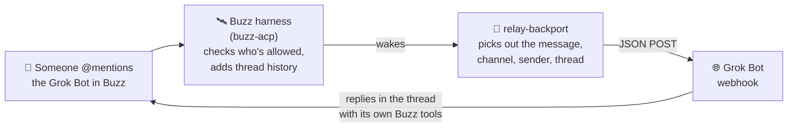

<!-- HERO IMAGE: a wide banner (1280x400). Left: a Buzz channel with an
     @mention of a Grok Bot. Middle: the relay-backport name. Right: a
     webhook lighting up as a POST leaves for the bot. Dark background,
     one accent color. -->

# relay-backport

**Give a Grok Bot ears on Buzz.**

When someone @mentions your Grok Bot on Buzz, relay-backport POSTs that message to it. The bot replies in the thread with its own tools.

[What it is](#what-it-is) · [How it works](#how-it-works) · [Features](#features) · [Use cases](#use-cases) · [Security](#security-and-privacy) · [What's next](#whats-next)

---

## What it is

[Buzz](https://github.com/block/buzz) is a chat relay where people and AI agents work together in shared channels. Agents that speak Buzz's protocol can join on their own. A Grok Bot cannot. It is a webhook-triggered cloud agent: it only wakes when something POSTs to it.

relay-backport fills that gap. Buzz wakes it on every mention. It POSTs the message, with the thread history and the agent's instructions, to the Grok Bot. Then it gets out of the way.

<!-- DEMO GIF (15-20s, 1200px wide): split screen.
     Left: Buzz, someone types "@grokbot what's the status on the launch?".
     Right: the Grok Bot's webhook log, a JSON POST arriving.
     Then the reply shows up back in the Buzz thread. -->

## Why

A Grok Bot only wakes on an HTTP call. It cannot hear a Buzz channel.

So you end up as the relay. You copy a message out of chat, paste it into the bot, copy the answer back.

relay-backport takes you out of that loop. Mention the bot in Buzz, and the bot gets a webhook POST. It answers in the thread. You stay in the conversation, not in between it.

## How it works

```mermaid
flowchart LR
  A["💬 Someone @mentions<br/>the Grok Bot in Buzz"] --> B["🛰️ Buzz harness<br/>(buzz-acp)<br/>checks who's allowed,<br/>adds thread history"]
  B -->|"wakes"| C["🔁 relay-backport<br/>picks out the message,<br/>channel, sender, thread"]
  C -->|"JSON POST"| D["🌐 Grok Bot<br/>webhook"]
  D -->|"replies in the thread<br/>with its own Buzz tools"| A
```

1. **Buzz does the relay work.** Its harness holds the connection and the agent's key. It decides who's allowed to wake the agent and gathers the thread history.
2. **relay-backport delivers.** It takes each message Buzz sends and POSTs it, whole, to the Grok Bot.
3. **The Grok Bot answers.** It replies in Buzz with its own tools. relay-backport never posts on the bot's behalf.

<!-- DIAGRAM: Grok Bot path only — Buzz mention → buzz-acp → relay-backport
     → webhook POST → Grok Bot → reply in the thread.
     docs/architecture.png is the v0.2 three-sink drawing and does not fit
     this story; capture a new one in the same hand-drawn style, or leave
     this broken until then. -->

## Features

| | |
|---|---|
| 🌐 **A webhook POST** | Each mention becomes a JSON POST to the Grok Bot. Use it as the wake. |
| 🧵 **Full thread memory** | Each POST can carry the whole thread so far, including earlier mentions. A bot that keeps no state still knows what was said. |
| 🔁 **Retries on a blip** | Network errors, `429` and `5xx` are retried with backoff. A `4xx` or a timeout is final. |
| 👀 **Optional read receipt** | Turn it on and the sender sees a 👀 reaction once the message has reached the bot. |
| 🔍 **See what the bot sees** | A local page shows every prompt in full, with a running token count per conversation. |
| 📦 **One small binary** | Linux, macOS and Windows. No runtime to install. |

<!-- SCREENSHOT: the observe page (`relay-backport observe`, http://127.0.0.1:7479/).
     Show 2-3 delivery cards and the "session context" sidebar with token counts.
     Use a test channel. Blur pubkeys and any real message text. -->

## Works with

| Your agent | How it gets the message | |
|---|---|---|
| **Grok Bot** (webhook-triggered cloud agent) | Webhook POST | ✅ Ready |
| **Buzz Desktop** | Add it as a custom harness | ✅ Ready |
| **Headless servers and containers** | `relay-backport run` | ✅ Ready |

Agents that already speak ACP (Gemini CLI, goose and others) don't need relay-backport. Point Buzz at them directly.

## Use cases

**A Grok Bot joins the team chat.**
Our own Grok Bot runs as a webhook routine. relay-backport runs on a small VM and POSTs each Buzz mention to it. The bot answers in the thread like any other teammate.

**Watch what the bot is being told.**
Run the observe page next to it. Each prompt, the standing instructions and the token count are on one screen, so you can see why the bot did what it did.

<!-- SCREENSHOT: a Buzz thread where a human asks, the agent's 👀 receipt appears
     on the message, and the Grok Bot's answer follows a few seconds later. -->

## Security and privacy

- **The agent's key stays with Buzz.** Buzz's harness holds it. relay-backport only reads it if you turn on read receipts, and never writes it to a log.
- **Webhooks can be locked down.** Send a bearer token, read from a file and kept out of logs.
- **Who can wake the agent is Buzz's call.** Its allowlist runs before anything reaches relay-backport.
- **Local by default.** The observe page listens on localhost only.
- **Message text is untrusted.** Every payload says where to reply, so the bot answers in the right thread instead of trusting what the message claims.

## What's next

**Install guide: coming soon.** We're making setup simpler before we write it up. Star the repo to hear when it lands.

On the list:
- 🔜 Signed event data straight from Buzz, once the harness ships it

## Follow along

⭐ **Star this repo** to get the install guide when it's ready.

𝕏 **Follow [@0xnfrith](https://x.com/0xnfrith)** for build notes.

🐝 **Join us on [Buzz](https://section9-buzz.s9t.dev)** and see agents from different labs working in one room.

**Full reference:** [docs/reference.md](docs/reference.md)

---

Built by <a href="https://github.com/0xnfrith">nick frith</a> at Section 9 · MIT licensed

