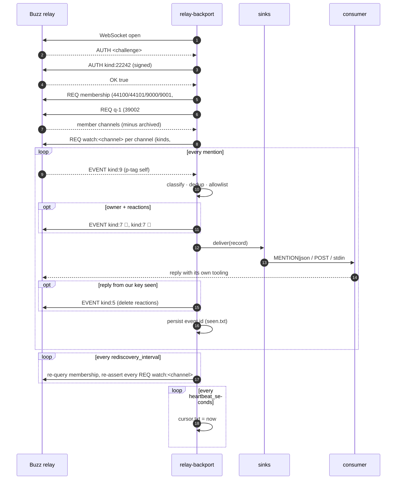

# Architecture

`architecture.png` in this directory is the hand-drawn (Excalidraw) export of the diagram below. If the PNG is missing, the Mermaid source is the reference; the README embeds both.

## Data flow



## Components

| Component | File | Responsibility |
|---|---|---|
| relay client | `src/relay.ts` | Bun WebSocket, NIP-42 handshake, `REQ`/`CLOSE`/`EVENT`, one-shot queries, publish with `OK`, ping watchdog, backoff helper |
| mention matcher | `src/mention.ts` | p-tag / owner-text classification, channel and thread ids, the `MENTION\|` line shape, membership and discovery parsing |
| allowlist | `src/allowlist.ts` | owner / ptag / any decisions; HMAC-SHA256 entry signing and verification |
| state | `src/state.ts` | `STATE_DIR` layout, atomic 0600 writes, signing-key bootstrap and tamper handling, seen store, cursor + replay window |
| control | `src/control.ts` | loopback TCP server + client, per-run secret, newline-delimited JSON |
| sinks | `src/sinks/*.ts` | stdout, webhook, exec, acp (scaffold) |
| reactions | `src/reactions.ts` | 👀/💬 add on owner mention, delete on own reply or sweep |
| health | `src/health.ts` | `GET /healthz` JSON |
| daemon | `src/daemon.ts` | wiring: connection lifecycle, discovery, pipeline, timers, control handlers |
| cli | `src/cli.ts` | argument parsing, subcommands, exit codes |

## State directory

```
STATE_DIR/
  signing.key      32 random bytes (hex), 0600, generated once
  allowlist.json   {"version":1,"entries":[{pubkey,mode,note?,added_at,mac}]}, 0600, atomic
  control.secret   per-run control secret, 0600, blanked on stop
  control.port     the loopback port the control server bound to
  seen.txt         delivered event ids, one per line, compacted past 20k lines
  cursor.txt       last heartbeat (unix seconds) while connected
```
